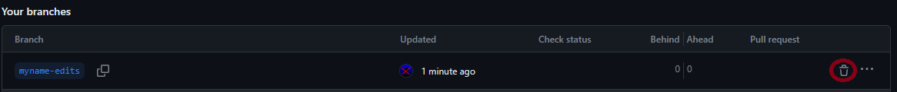
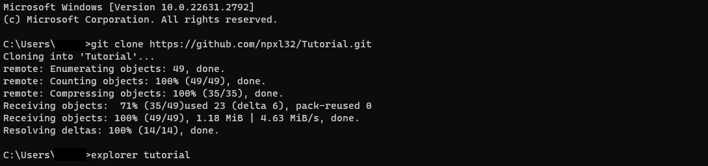
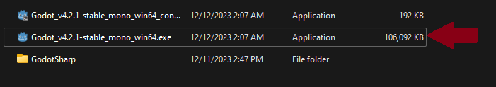

# Godot installation
At BluePlay, we make games in Godot (pronounced Go-dot, contrary to popular belief) using the .NET platform, a platform of programming languages made by Microsoft.
When you first join BluePlay, follow these steps.
- Get godot from [here](https://godotengine.org/download/windows/)

Make sure you get the .NET version.

- Extract the files, then move to the next step.
# .NET installation
.NET SDK version 6.X is needed to develop Godot games. 
- Install from [here](https://dotnet.microsoft.com/en-us/download/dotnet/6.0). We really recommend learning more about .NET from [dot.net](https://dot.net/), though it is not required.

Make sure to download the .NET 6 SDK.

- If you use Visual Studio, download 6.0 either from the Visual Studio version of the .NET SDK from [here](https://dotnet.microsoft.com/en-us/download/visual-studio-sdks) or through Visual Studio Installer > Visual Studio 2022 > Modify > Individual Components. 

# Visual Studio Installation (Optional) 
- Feel free to skip this section and develop with Godot's text editor - however, it really will make your life easier to use Visual Studio.
- We recommend using Visual Studio while developing with .NET, as Visual Studio was specially designed for .NET and C++ and contains many useful features to speed up development and reuse code from others. Download Visual Studio 2022 from [here](https://visualstudio.microsoft.com/).
- - You can find instructions to use it with Godot [here](https://docs.godotengine.org/en/stable/contributing/development/configuring_an_ide/visual_studio.html). (Note that Visual Studio does _not_ require a solution file, you can select "Open Folder" or "Open .csproj" and it will generate a solution file)
- Visual Studio will also aid you on developing things other than games, such as .NET MAUI cross-platform applications. If you use Visual Studio for other things, we recommend using .NET 8, but Godot games will use .NET 6.
# .NET important things to know
Now that you've installed the .NET SDK, you're a part of the .NET community! Here are some important things to know:
- .NET is _not_ a programming language. It is a platform of programming languages, like C# and VB, that all compile to a language called "IL". This IL code is then run through the .NET runtime, which works on all operating systems.
- If you ever see the words "Mono", "MonoTouch", or "Mono for Android", that's because .NET used to be only for Windows and it was called the .NET framework back then, and Mono was an implementation for all platforms. Since those times, the newer .NET versions are also for all platforms, but a lot of software, like Unity, still uses Mono.

# Code editing
## Maintaining a branch
- If this is your first time, click the branches button.

- Now type a branch name and click "Create branch from main".

Congrats! You now have created a separate branch. 

- If this is not your first time, click the same branches button, but this time switch to the branch you already made instead of creating a new one.

- If you ever need to delete a branch, click on the same branches button, but click "view all branches".

- Then, click on the trash button next to the branch you want to delete.

## Editing the code and Git
- At BluePlay, if you can't tell yet, we use a distributed version control system called Git. It works by tracking changes made to files. There are also other distributed version control systems that exist, like Mercurial, Darcs and Azure DevOps. There are also non-distributed version control systems like Perforce, Subversion, and CVS. Additionally, there are even local only version control systems like RCS, SCCS, and The Librarian. Read more [here](https://git-scm.com/book/en/v2/Getting-Started-About-Version-Control).<!--Seriously don't delete this, it's extremely important to know what the software you're using does on a high level. You shouldn't have deleted the part about .NET either, you should probably re-add that with some omitted parts-->
- On Git, forking a repository is when you create your own duplicate to make your own changes.
- On Git, a commit is a change to the files.
- On Git, a pull request (aka PR, or MR/Merge Request on GitLab) is when you request code from your fork to be merged with the original repository.
- On Git, a repository hosted on a Git service like GitHub or GitLab is called a remote repository (or just remote).
- On Git, a repository hosted on your machine is called a local repository. You can clone a remote repository to get a local version of it, and you can use the local repository to commit to the remote repository.
- On Git, a push is when you push your commits from your local repository to the remote repository.
- On Git, a pull (not to be confused with a pull request) is when you pull the remote repository's commits to your local repository.
- At BluePlay, we recommend you use GitHub Desktop or Git CLI (not to be confused with GitHub CLI) to edit your code with bigger commits. The difference is that GitHub Desktop is GitHub only, while Git CLI works with any Git service (like GitHub, GitLab, and Bitbucket), and that you'll have to know how to use a command line to use Git CLI.
- To edit the code: follow these steps:

1. Go into the repository on GitHub. 
2. If this is a small commit, like a change to a README, you can use the pencil button on the GitHub view of your repository. 
3. If this is a game, and you haven't cloned it yet, click the green code button.

4. Clone it using GitHub Desktop or Git CLI with the URL it gives you. Git CLI example: 

GitHub Desktop example (File > Clone Repository):

5. It will now have created a directory with the cloned repository in it. If you are following along on Git CLI, you will only have cloned the main branch. Follow these steps to create your own branch:
- Switch your command line into the directory of the cloned repository with the CD command
- Type "git checkout -b &lt;your_branch_name&gt;"
- Type "git pull origin &lt;your_branch_name&gt;"

Woah! That's a lot. What does that mean?

Firstly, CD will change the directory you are working in.
Second, git checkout -b &lt;branch_name&gt; will create a branch on your local repository.
Third, git pull origin &lt;branch_name&gt; will update your local copy of the branch with the commits from the remote.

6. If you are on Windows and following along using Git CLI, we recommend opening the directory via the command line to get used to the CLI. You can do this by using "explorer" as if it were a command.

If you are on GitHub Desktop, you can switch to your branch using the menu above and then navigate to the folder created from cloning the repository and open the code in your favorite text editor or IDE.

Once it is done, you can now edit the code and push the changes to the remote repository using Git!
Now that you've got a local copy of the remote repository, open it in Godot:
1. Open Godot, (found in your extracted folder, make sure not to open the "console" version.) 

2. Click Import

3. Select the folder containing the repository you cloned. (Of course, normally you would select a Godot game repository instead of a README repository)

Once you import the folder into godot, hit ctrl+s.
- Once you are done editing the game, use GitHub Desktop or the Git CLI to push your changes to your fork. Here is a tutorial for Git CLI:
1. Change to the directory that the repository is in with the "CD" command. (The equivalent of double-clicking a folder in explorer)
2. Switch to your branch with "git checkout -b &lt;your_branch&gt;"
3. Add all files to the commit with "git add --all".
4. Actually do the commit with "git commit -m [commit message here]".
5. Push the commit with "git push origin &lt;your_branch&gt;". (This step will make the commits appear on GitHub)

5. BONUS: if you make a change on GitHub, it will not let you push until you pull (what). Type "git pull" to do this.
6. BONUS BONUS: if you need to make an empty commit, type "git commit -m [commit message here] --allow-empty" instead of "git commit -m [commit message here]".
- Here is a tutorial for GitHub Desktop:
1. Open GitHub Desktop
2. Write in the commit message box and hit "commit to main".

3. Use repository > push to push your changes to GitHub.

4. BONUS: if you make a change on GitHub Web, it will not let you push until you pull (what). Select Repository > Pull to do this.

5. BONUS BONUS: you might find yourself someday needing to re-trigger a CI action. you would need to make an empty commit for that. you can't do that with GitHub Desktop, unfortunately.

- Back on GitHub Web, open a pull request.
