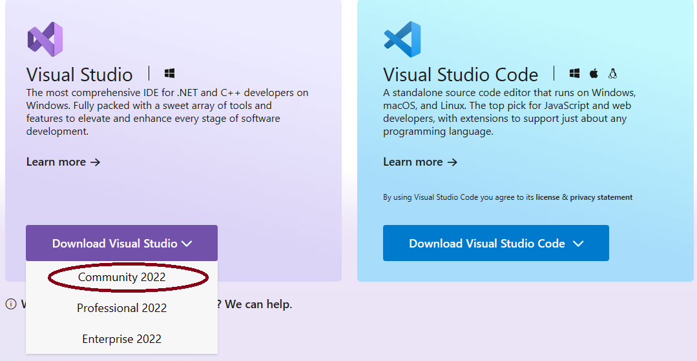

<B> If you have any issues following these steps, create an issue under the Issues tab on this repository. </b>
# Godot installation
At BluePlay, we make games in Godot (pronounced Go-dot, contrary to popular belief) using the .NET platform, a platform of programming languages made by Microsoft.
When you first join BluePlay, follow these steps.
- Get godot from [here](https://godotengine.org/download/windows/)

Make sure you get the .NET version.

- Extract the files, then move to the next step.
# .NET installation
.NET SDK version 6.X is needed to develop Godot games. 
- Install from https://dotnet.microsoft.com/en-us/download/dotnet/6.0

Make sure to download the .NET 6 SDK.

- If you use Visual Studio, download 6.0 either from the Visual Studio version of the .NET SDK from [here](https://dotnet.microsoft.com/en-us/download/visual-studio-sdks)

 or through Visual Studio Installer > Visual Studio 2022 > Modify > Individual Components.

# Visual Studio Installation (Optional, but highly recommended)
- We recommend using Visual Studio while developing with .NET, as Visual Studio was specially designed for .NET and C++ and contains many useful features to speed up development such as IntelliSense and GitHub code snippet finder. Download Visual Studio 2022 from [here](https://visualstudio.microsoft.com/).

- You can find instructions to use it with Godot [here](https://docs.godotengine.org/en/stable/contributing/development/configuring_an_ide/visual_studio.html). (Note that Visual Studio does _not_ require a solution file, you can select "Open Folder" or "Open .csproj" and it will generate a solution file)
- Visual Studio's other features like hot reload will also aid you on developing things other than games,  such as .NET MAUI cross-platform applications. If you use Visual Studio for other things, we recommend using .NET 8, but Godot games will use .NET 6. 
# .NET community
- Now that you've installed the .NET SDK, you're a part of the .NET community! We welcome you to start exploring .NET for yourself.
- npxl32 has previous experience as a .NET developer, so ask them for help if you need it.
- .NET is a platform of programming languages and libraries created by Microsoft. The platform most prominently includes the langauges C# (C-Sharp), F# (F-Sharp), and VB.
- The .NET platform lets you create cross-platform apps for Desktop, Mobile, and Apple TV, single-page application websites, normal websites, machine learning applications, IoT apps, Games through [a lot of game engines](https://dotnet.microsoft.com/en-us/apps/games/engines), and Cloud Applications!
- C# is the most used .NET language, and is very similar in terms of syntax to other programming languages. C++, Java, and JavaScript developers will feel right at home developing in C#!
- These languages all compile to a single language called "IL" (Intermediate Language). This is also sometimes called MSIL (Microsoft Intermediate Language). The IL code is then executed through the .NET runtime, which works on all major operating systems. The .NET runtime can either be packaged with your app or installed separately by your users.
- There are multiple implementations of .NET that have been made. First there was the .NET framework released in 2002. The .NET framework was Windows-only and was composed of VB and C#. Then came Mono, which aimed to create a cross-platform implementation of the .NET framework. Mono worked on Windows, Mac, and Linux, and still exists today as a shadow of its former self. Next came Xamarin which was a company that supported Mono, and created Xamarin.Android (formerly Mono for Android) and Xamarin.iOS (formerly MonoTouch.) After that, there was .NET Core which was an official cross-platform implementation of the .NET framework by Microsoft. Around this time, they also bought Xamarin. Xamarin.Forms is what followed, which was a cross-platform app creation framework that would let you build for Windows, Linux, Android, and even Samsung Tizen and Apple tvOS. Afterwards, Microsoft created .NET MAUI, the evolution of Xamarin.Forms, which adds MacOS and iOS support via MacCatalyst.
- NuGet is .NET's package manager, which is where you can find libraries to use in your .NET code.
# To contribute
On the repository you would like to contribute to, follow these steps.
- If this is your first time, click "fork" repository, and fork the repository. 
- Edit the code as described in "code editing".
- Go back to the original repository, click on "Pull Requests", and open a new pull request.
# Code editing
- Go into your fork of the repository.
- Now, if this is not a game, you can simply edit it with the pencil button.
- If this is a game, click code, then Download Zip
- Now open Godot, (found in your extracted folder, make sure not to open the "console" version.) 

- Click Import

- Click the zip file you downloaded. 
<b> Once you import the file into godot, hit CTRL+S, delete any old versions, and the original zip file.
- Once you are done editing the game, under project, click export, export as zip, delete every file on your fork, and then upload the zip to your fork.
- Open a pull request.